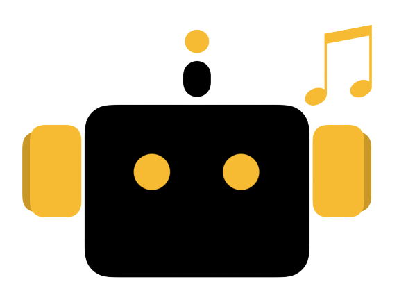
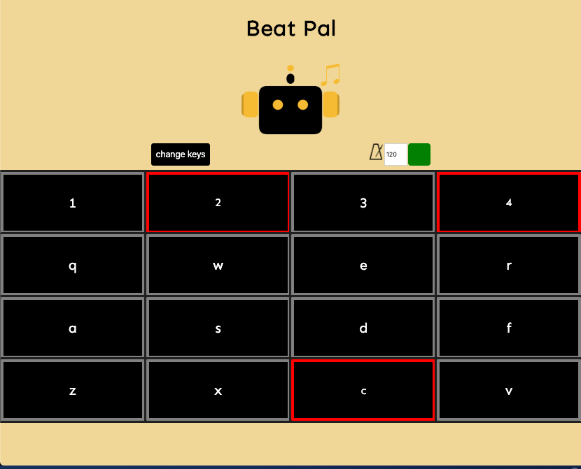

# Beat Pal 

_Programmable Drum Machine_

[Beat Pal][deployed-link] is a small application meant to aid musicians looking to make drum
beats from their laptop keyboard!

It was constructed for the Fullstack Academy's "Stack-a-thon" where we were
tasked to create a project start-to-finish, in about 4 days.

Currently only a MVP, it features custom key bindings, a dynamic metronome, and
click-to-audition functionality and is deployed [here][deployed-link]

Though it may have been simpler to use basic HTML elements here, Beat Pal uses
[Tone JS][tone-doc], a very powerful and robust audio synthesis library to
build out this application, as I would like to be able to add more complex and
interesting features better handled by Tone JS's arsenal of tools.

[tone-doc]: https://tonejs.github.io/
[deployed-link]: https://beatpal.herokuapp.com/

## Setup

If you'd like to clone this down and play with the code yourself, it's fairly
straight forward. I've even included a few default configs and assets in the
client and public folder, respectively.

1.  fork the repo
2.  `npm install`
3.  `npm run start` for production, or `npm run start-dev` for dev mode.
4.  Jam out!

## Future Plans

One thing I strove for when coming up with this idea, was to find something
that was modular, and could be added to easily. I think there are countless
possibilities in what could be added to Beat Pal (and suggestions are welcome!)

Here is a list of features I have in mind for the near future:

* Recording functionality: Being able to record download your beats
* Play-along Game: a stream of keys go on screen, and you must play along
  (similar to guitar hero)
* Upload your own sounds
* Swap between configurations
* Create custom configs

## The Journey and What I Learned

Making Beat Pal was incredibly rewarding. There is something I love about being
given a blank slate, and being told to just 'go!' I jumped at the chance to
explore my technical learning into another long interest of mine, music. Tone JS
is something I've known about for awhile and I'm happy to have gotten my hands
dirty in it.

Dirty is a great word to describe the exprience I think, because especially as a
hackathon project, I sure did hack this thing together in places.

One of the largest issues I faced was simply just getting the corresponding pad
to light up once that key was pressed, and allowing for multiple pads to light
up independently. This feature seemed directly at war with another piece of
functionality I was hell-bent on having, and that is that when keying up it
should not play the other sounds that are currently still being help down. In
order to accomplish both of these things in tandem, I kept track of the latest
key pressed, and also seeing if the array of 'keys pressed' had just gotten
bigger or smaller(Important context here is that the function to play the sound
exists in the "Pad" React component's `componentDidUpdate` method), and
would play the song accordingly.

I learned so much from this project, and I really think ultimately, this was an
exercise in state, UI/UX, and frontend logic. I've always felt more comfortable
on the backend, so exploring this space was incredibly enlightening. I'm excited
to see how Beat Pal can grow from here, and as always, please try to break it!

## Known Bugs

List of of known issues I plan to resolve:

* Metronome sometimes will ring indefinitely, needing a page refresh to resolve
* Incrementing the bpm of the metronome while playing is inconsistent
* All done buttons in edit screen close all others. I plan to either make each
  pad customizable independently, or will just add one central done button to
  fix this
* Sometimes, the first sound played is significantly delayed
